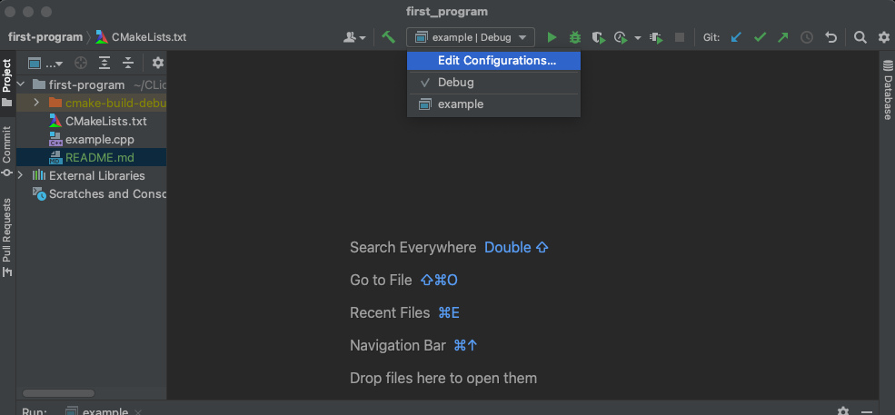
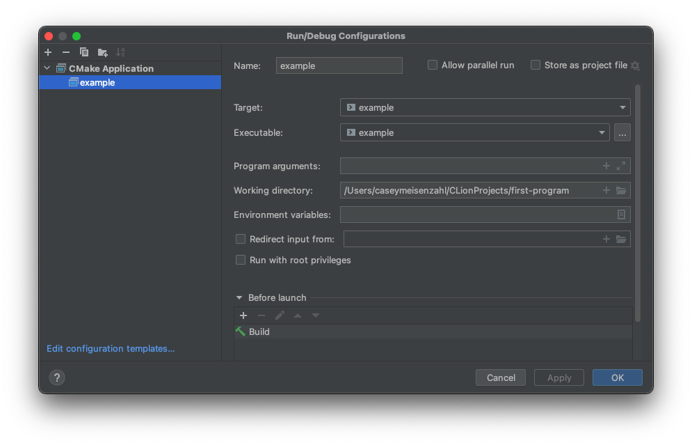

# Install OpenCV on macOS and run barcode contrib example in CLion

Based on this [tutorial](https://nhancv.medium.com/config-cmake-opencv-for-clion-a1ee72c03f4)

### Install [Homebrew](https://brew.sh/)
```bash
/bin/bash -c "$(curl -fsSL https://raw.githubusercontent.com/Homebrew/install/HEAD/install.sh)"
```

### Install OpenCV

```bash
brew install opencv
```

### Note install location 

```bash
brew info opencv
```
output

install location: `/usr/local/Cellar/opencv/4.5.4_3`

```
opencv: stable 4.5.4 (bottled)
Open source computer vision library
https://opencv.org/
/usr/local/Cellar/opencv/4.5.4_3 (852 files, 236.7MB) *
  Poured from bottle on 2022-01-15 at 13:40:50
From: https://github.com/Homebrew/homebrew-core/blob/HEAD/Formula/opencv.rb
License: Apache-2.0
==> Dependencies
Build: cmake ✔, pkg-config ✔
Required: ceres-solver ✔, eigen ✔, ffmpeg ✔, glog ✔, harfbuzz ✔, jpeg ✔, libpng ✔, libtiff ✔, numpy ✔, openblas ✔, openexr ✔, protobuf ✔, python@3.9 ✔, tbb ✔, vtk ✔, webp ✔
==> Analytics
install: 18,331 (30 days), 48,370 (90 days), 183,560 (365 days)
install-on-request: 17,424 (30 days), 46,259 (90 days), 176,003 (365 days)
build-error: 137 (30 days)
```


### Install CLion
[Download CLion](https://www.jetbrains.com/clion/download/#section=mac)

### Create your project or clone this repo
```bash
git clone git@github.com:caseymeiz/first-program.git
```

### Configure your CMakeLists.txt
```CMake
cmake_minimum_required(VERSION 3.21)
set(CMAKE_CXX_STANDARD 11)
project(first_program)

# MAKE SURE THIS MATCHES YOUR INSTALL LOCATION
set(OpenCV_DIR "/usr/local/Cellar/opencv/4.5.4_3")

find_package(OpenCV REQUIRED)
add_executable(example example.cpp)
target_link_libraries(example ${OpenCV_LIBS})
```

### Add some example code to example.txt
This repo has the barcode reader sample [barcode.cpp](https://github.com/opencv/opencv_contrib/blob/4.x/modules/barcode/samples/barcode.cpp)

### Create your run config
Setup which file to run and working directory



### Run the program
It will ask to use your camera. Click accept.
Hold a book or something with a barcode in from of the camera.
